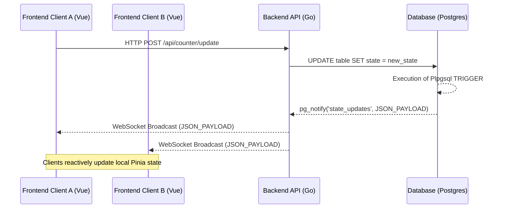

# System Architecture & Design: Real-Time Postgres Counter

## Overview
This document outlines the architecture and design of a full-stack real-time application. The core philosophy of this system is that **PostgreSQL is the single source of truth**, and any state changes are synchronized in real-time across all connected clients using a combination of PostgreSQL's `LISTEN/NOTIFY` mechanism and WebSockets.

## Technology Stack
- **Frontend**: Vue 3, Vite, PrimeVue 4, Pinia (for state management), TypeScript, Bun (package manager).
- **Backend**: Go 1.22, `go-chi` (routing), `pgx` (Postgres driver), Gorilla WebSockets.
- **Database**: PostgreSQL 16.
- **Tooling/Orchestration**: Docker, Docker Compose, `just` (command runner).

## High-Level Architecture
The system follows a reactive, event-driven architecture.

1. **Client Action**: A user interacts with the Vue frontend to mutate state (e.g. increment a counter).
2. **HTTP Request**: The frontend sends a standard HTTP POST request to the Go backend.
3. **Database Update**: The backend updates the database table in PostgreSQL.
4. **Trigger & Notify**: An internal PostgreSQL trigger fires on the update, executing a `NOTIFY` command over a dedicated channel with the new state payload.
5. **Backend Listen**: The Go backend (which holds a persistent connection to Postgres via `LISTEN`) receives the notification.
6. **WebSocket Broadcast**: The backend broadcasts the updated state over WebSockets to all connected frontend clients.
7. **Frontend State Update**: The Pinia store receives the WebSocket message and instantly updates the UI for all clients.

### System Diagram

## Frontend Design (Vue 3 + Pinia)

The frontend adheres strictly to the **Single Responsibility Principle (SRP)** by decoupling UI components from business logic and application state.

- **State Management (Pinia stores)**:
  - `useWebSocketStore.ts`: Manages a highly robust, singleton WebSocket connection. It handles reconnect logic, message parsing, and routing incoming events to their respective domain stores.
  - `useCounterStore.ts` (Domain Store): Owns domain-specific state. It exposes actions to trigger API calls and mutates internal state reactively when the `useWebSocketStore` receives a broadcast.
- **Components**: Vue components are purely presentational. They consume state via `storeToRefs()` and trigger actions exposed by the Pinia stores. They do not handle raw network requests directly.
- **Styling**: Relies entirely on PrimeVue 4's built-in design system and utilities. Ad-hoc CSS is prohibited to maintain design consistency.

## Backend Design (Go)

The Go backend implements strict modularization, avoiding monolithic patterns.

- **Routing**: `go-chi` is used to map standard REST HTTP handlers.
- **Database Subsystem (`pgx`)**: 
  - Standard modules to handle synchronous CRUD operations.
  - A dedicated background worker routine holds a persistent `LISTEN` connection to Postgres, blocking and waiting for `pg_notify` payloads.
- **WebSocket Hub**: A dedicated package manages all active client connections (`github.com/gorilla/websocket`). It safely handles client registration, unregistration, heartbeat, and safely broadcasting inbound Postgres notification payloads to all active sockets concurrently.

## Database Design (PostgreSQL)

The database acts not just as persistent storage, but as the active orchestrator of state synchronization across distributed application replicas.

- **Triggers and Functions**: Plpgsql functions are bound to `AFTER INSERT/UPDATE/DELETE` triggers on key system tables.
- **pg_notify**: Whenever rows mutate, the trigger utilizes `pg_notify` to send a serialized JSON payload describing the mutation up to the connected Go backends.

## Orchestration & Developer Experience
- **Docker Compose**: Entirely containerized environment mapping the Vue Vite dev server, the Go hot-reloading API server, and the Postgres persistent database.
- **Justfile Commands**:
  - `just up`: Builds and daemonizes all containers.
  - `just down`: Safely unmounts running containers.
  - `just logs`: Streams aggregated logs. Absolutely critical for observing the WebSocket traffic and Postgres NOTIFY pipeline.
  - `just reset`: Performs a hard reset—destroys containers, completely wipes database volumes, and re-initializes environments.

## Core Architectural Rules
1. **Source of Truth**: If state isn't in Postgres, it doesn't exist. All application processes treat the database as the absolute authority.
2. **Broadcast Reactivity**: Clients must be driven by server broadcast events. Do not rely on polling.
3. **Decoupled Architecture**: Backend systems should not mix WebSocket hub logic with database triggers. Frontend systems should not mix Socket listening with Vue DOM rendering.
